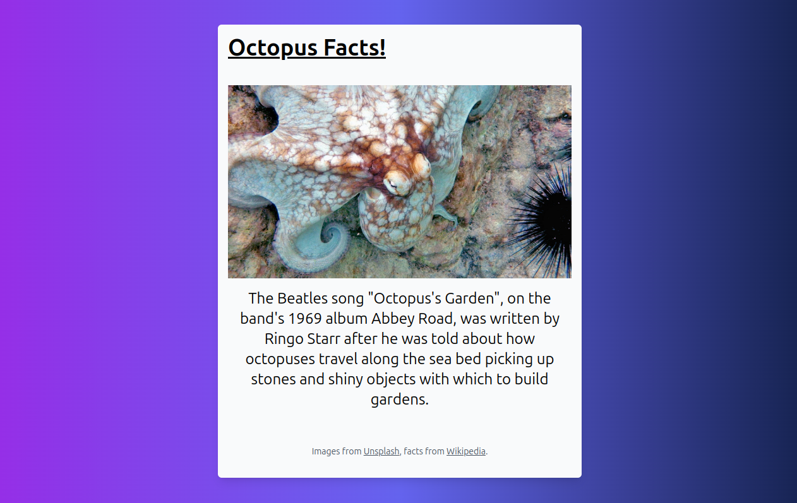

# OctoFacts!

This is a Laravel demo application built to showcase Chainguard's [Laravel](https://edu.chainguard.dev/chainguard/chainguard-images/reference/laravel/) image. It's a simple application that allows users to view facts about octopuses.



The complete guide on how to use Chainguard's Laravel images to build and deploy this application can be found [here](https://edu.chainguard.dev/chainguard/chainguard-images/getting-started/laravel/).

_Built with [Laravel](https://laravel.com) and [TailwindCSS](https://tailwindcss.com)._

## Installing

After cloning this repo, run:

```shell
composer install
npm install
./artisan migrate --seed
```

## Running

Running Vite for Development (will block your terminal for live updates):

```shell
npm run dev
```

Using the built-in web server to serve the app:

```shell
./artisan serve
```
